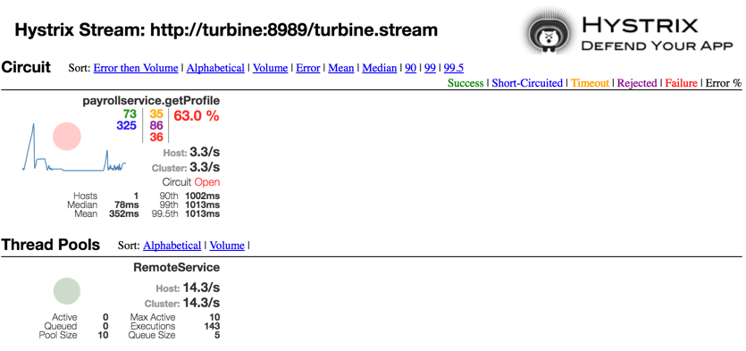

# SpringCloudAPI
This project uses [Spring Cloud Netflix](http://cloud.spring.io/spring-cloud-netflix/) to show
* Service Discovery - [Eureka](https://github.com/Netflix/eureka)
* Router and Filter - [Zuul](https://github.com/Netflix/zuul)
* Circuit Breaker - [Hystrix](https://github.com/Netflix/hystrix)
* Client Side Load Balancer - [Ribbon](https://github.com/Netflix/ribbon)

## Pre-Requisites
The following requires brew to be installled

### brew and cask
```
/usr/bin/ruby -e "$(curl -fsSL https://raw.githubusercontent.com/Homebrew/install/master/install)"
brew tap caskroom/cask
```

### virtual box
```
brew cask install virtualbox
```

### docker-machine
```
brew install docker-machine
```

### docker-compose
```
curl -L https://github.com/docker/compose/releases/download/1.6.2/docker-compose-`uname -s`-`uname -m` > /usr/local/bin/docker-compose
```

### JQ
```
brew install jq
```

### JDK8
```
brew cask install java
```

### maven
```
brew install maven
```

### git
```
brew install git
```

## Install
```
cd /tmp/
git clone https://github.com/nirving-versent/SpringCloudAPI.git
cd SpringCloudAPI/
docker-machine create
./buildDocker.sh
docker-compose up
```

## Test
1. Get the current IP Address of the machine

   ``DOCKER_IP=(`docker-machine ip default`)``
2. Test the Composite Service

   `curl -s http://$DOCKER_IP:8765/service-payroll/payroll | jq .`

   It will return one of the following

   Timeout
   ```
   {
      "timestamp": 1459724104421,
      "status": 500,
      "error": "Internal Server Error",
      "exception": "com.netflix.zuul.exception.ZuulException",
      "message": "TIMEOUT"
    }

   ```
   Exception
   ```
   {
      "timestamp": 1459723983589,
      "status": 500,
      "error": "Internal Server Error",
      "exception": "com.netflix.hystrix.exception.HystrixRuntimeException",
      "message": "getProfile failed and fallback failed.",
      "path": "/payroll"
   }  
   ```
   Success
   ```
   [
      {
        "employee": {
          "id": 1,
          "name": "John"
        },
        "salary": 1500,
        "employeeName": "John"
      },
      {
        "employee": {
          "id": 2,
          "name": "Sarah"
        },
        "salary": 3000,
        "employeeName": "Sarah"
      },
      {
        "employee": {
          "id": 3,
          "name": "Matt"
        },
        "salary": 4500,
        "employeeName": "Matt"
      },
      {
        "employee": {
          "id": 4,
          "name": "Linda"
        },
        "salary": 6000,
        "employeeName": "Linda"
      }
  ]
   ```
## Turbine
1. Open a web browser by copying the output from the following command
   ```
   echo http://$DOCKER_IP:8761/hystrix/monitor?stream=http%3A%2F%2Fturbine%3A8989%2Fturbine.stream
   ```
2. Perform testing using `ab`
   ```
   ab -n 1000 -c 10 http://$DOCKER_IP:8765/service-payroll/payroll
   ```
3. Check the Hystrix Console to see the status of the requests.
   
